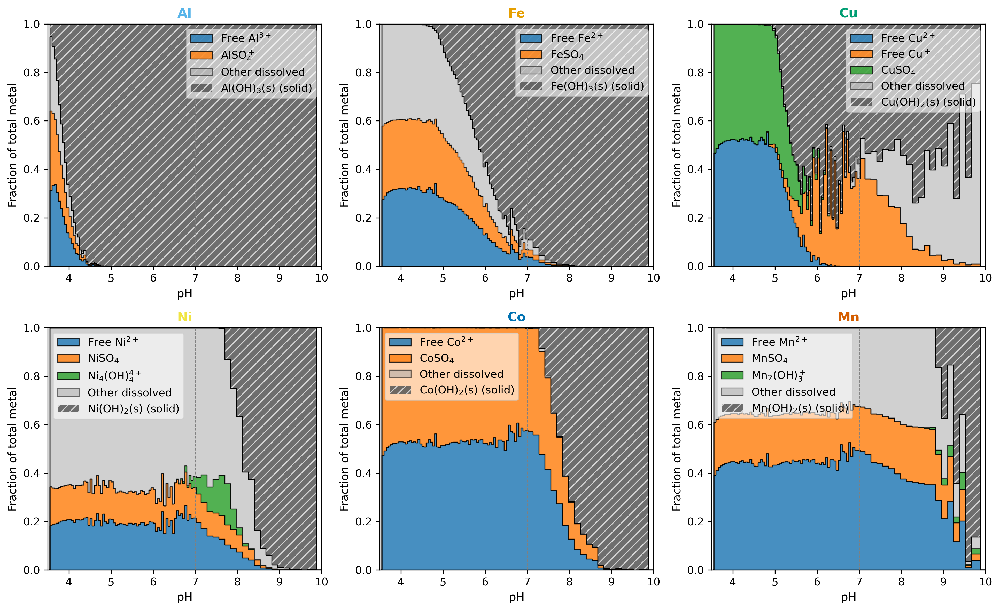

<div align="center">

*High-throughput Modeling of Thermodynamic Pathways Governing Digestion and Crystallization in Hydrometallurgical Battery Recycling*

**Vahid Attari · Cara Cronin · Blessing Cao · Ryan P. Jansonius · Michael Greenwood · Jason Hattrick-Simpers**

CanmetMaterials, Natural Resources Canada, Mississauga, ON *(Attari, Hattrick-Simpers)*  
CanmetMaterials, Natural Resources Canada, Hamilton, ON *(Greenwood)*  
Telescope Innovations, Vancouver, BC *(Cronin, Cao, Jansonius)*

---


[](https://doi.org/10.5281/zenodo.XXXXXXX)


[Report a Bug](https://github.com/vahid2364/selective-recovery-thermodynamic-modeling-battery-metals/issues/new?labels=bug) · [Request a Feature](https://github.com/vahid2364/selective-recovery-thermodynamic-modeling-battery-metals/issues/new?labels=enhancement)

</div>

---

## Overview

This repository contains the simulation pipeline, analysis scripts, and data supporting the above manuscript. The work propagates 12,001 leachate compositions spanning NMC, NCA, and LCO cathode chemistries through a Gibbs free-energy minimization framework (PHREEQC with the SIT activity model) to map thermodynamic precipitation windows for Al, Fe, Cu, Co, Ni, and Mn hydroxides during NaOH neutralization.

Key findings:
- The precipitation hierarchy Al(OH)₃ → Fe(OH)₃ → Cu(OH)₂ → Co(OH)₂ ≈ Ni(OH)₂ → Mn(OH)₂ is **composition-invariant** across the full leachate space.
- The Co/Ni separation window (ΔpH ≈ 0.3) establishes a **practical thermodynamic limit** — pH adjustment alone cannot reliably fractionate these metals across the investigated compositional space.
- The Cu→Co gap (ΔpH ≈ 2.2) is a robust, exploitable window for impurity removal.



---

## Requirements

- **PHREEQC** 3.8.6 with the `sit.dat` database ([IPhreeqc or standalone](https://www.usgs.gov/software/phreeqc-version-3)) — public domain software produced by the U.S. Geological Survey; free to use for any purpose with no licensing restrictions
- **Python** ≥ 3.10 with: `numpy`, `pandas`, `matplotlib`, `scipy`, `pyDOE2` (or `pyDOE3`), `seaborn`

Install Python dependencies:
```bash
pip install numpy pandas matplotlib scipy pyDOE2 seaborn
```

---

## Reproducing the Results

### 1. Generate LHS compositions and run PHREEQC
```bash
cd paper_SIT/Leach_recovery_UP6
bash run.sh
```
This runs `DOE_phreeqc_init.py` (generate 12,001 LHS samples) → `DOE_phreeqc_run.py` (call PHREEQC) → `res_input_merge.py` (consolidate outputs).

### 2. Generate figures
```bash
python plot_all_mix1.py
python plot_all_mix2_b.py
python plot_all_mix2_eq.py
```

Standalone figures (Pourbaix diagrams, onset pH, LHS diagnostics) are in `src/`:
```bash
python src/plot_onset_pH.py
python src/plot_pourbaix_speciation.py
```

---

## Data

Simulation outputs (generated by `bash run.sh`) are written to `paper_SIT/Leach_recovery_UP6/speciation_results_merged/`. Each file contains one row per LHS sample (12,001 total):

| File | Contents | Dimensions | Size |
|---|---|---|---|
| `DOE_merged_mix1_react.csv` | Step-by-step speciation along NaOH titration (dissolved concentrations, activity coefficients, solid-phase masses, saturation indices) | 12,001 × 142 | ~13 MB |
| `DOE_merged_mix1_i_soln.csv` | Initial solution properties at zero NaOH addition (pre-neutralization state for each LHS sample) | 12,001 × 142 | ~10 MB |
| `DOE_merged_mix2_react.csv` | Mixed-leachate reaction output including solid precipitation moles per titration step | 12,001 × 142 | ~13 MB |
| `DOE_merged_mix2_eq_react.csv` | Equilibrium phase analysis at final NaOH dose | 12,001 × 142 | ~13 MB |

---

## Citation

If you use this code or data, please cite:

> Attari V., Cronin C., Cao B., Jansonius R.P., Greenwood M., Hattrick-Simpers J.
> *High-throughput Modeling of Thermodynamic Pathways Governing Digestion and Crystallization in Hydrometallurgical Battery Recycling.*
> *(journal, year, DOI — to be updated upon publication)*

---

## License

This repository is released under the [Creative Commons Attribution 4.0 International License (CC BY 4.0)](LICENSE).
You are free to share and adapt the material for any purpose, provided appropriate credit is given.
